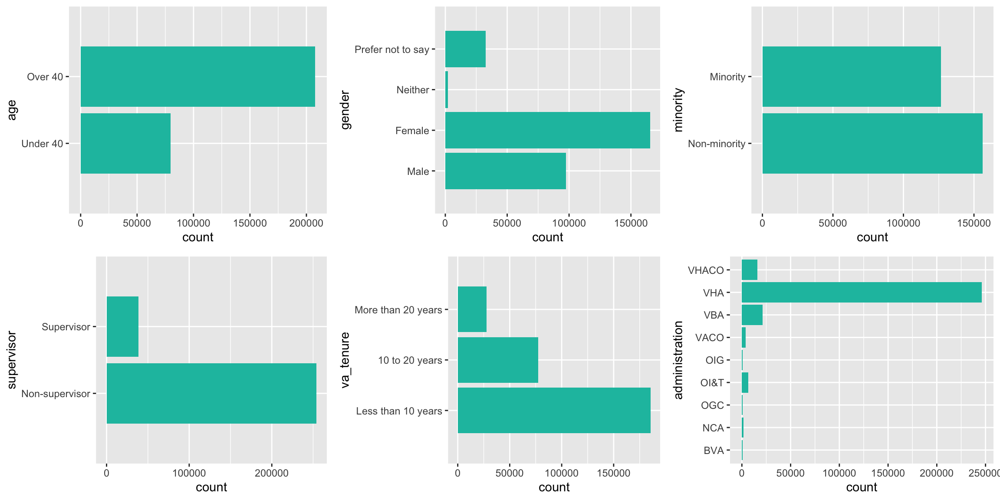
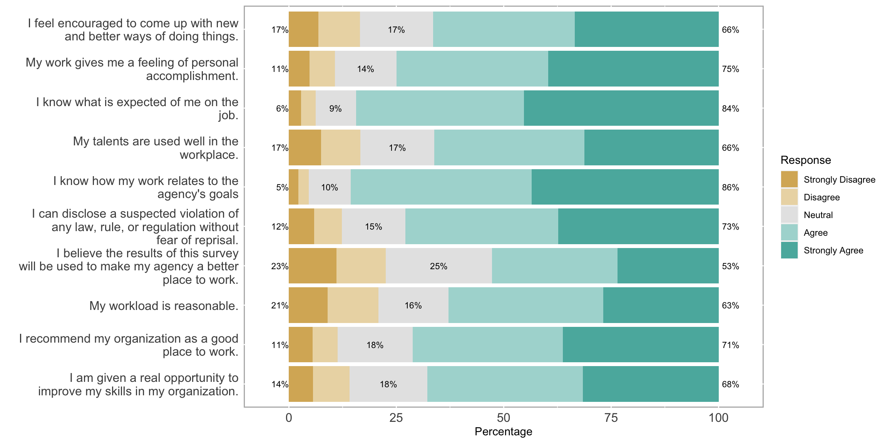

# VA-AES-2022
Exploratory analysis of the 2022 VA All Employee Survey (2022)

## About
Exploring the 2022 All Employee Survey data that is made publicly available by the VA [here](https://www.data.va.gov/dataset/AES-2022-PRDF/hfpp-r3wx). Understanding employee sentiment across multiple VA departments provides insights into how their work environments can be improved. Employee satisfaction in the VA could be indicative of the care veterans are receiving, so it's important to be mindful of their input.

## Preview
The analysis includes data exploration and plotting  using `ggplot2`:

Visualizing survey results using various R packages including `likert` and `dplyr`:

See the full exploratory analysis [here](https://rpubs.com/monicad9/1030538).
