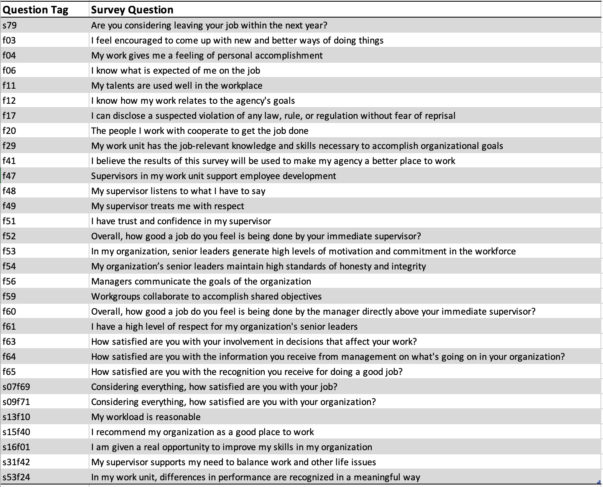

***

### Abstract

Exploring the 2022 All Employee Survey data that is made publicly available by the VA [here](https://www.data.va.gov/dataset/AES-2022-PRDF/hfpp-r3wx). Understanding employee sentiment across multiple VA departments provides insights into how their work environments can be improved. Employee satisfaction in the VA could be indicative of the care veterans are receiving, so its important to be mindful of their input. 

```{r, setup, include=FALSE}
knitr::opts_chunk$set(comment = "", 
                      fig.width = 6, 
                      fig.height = 6,
                      fig.path="../reports/figures/",
                      dev = "png"
)
```

***

**Environment Setup**

```{r prep_01, echo=F, eval=F, message=FALSE, warning=FALSE}
# install packages
install.packages("knitr")
install.packages("lattice")
install.packages("likert")
install.packages("dplyr")
install.packages("plyr")
install.packages("ggplot2")
install.packages("naniar")
install.packages("corrplot")
install.packages("ggcorrplot")
install.packages("gridExtra")
```


```{r prep_02, message=FALSE, warning=FALSE}
# set options
options(stringsAsFactors = F)         # no automatic data transformation
options("scipen" = 100, "digits" = 4) # suppress math annotation

# activate packages
library(knitr)
library(lattice)
library(tidyverse)
library(likert)
library(dplyr)
library(naniar)
library(ggplot2)
library(corrplot)
library(ggcorrplot)
```


```{r echo=FALSE}
cat6 <- c('#15BFAE', '#3F46Bf', '#F27B13', '#D94188', '#7E84FA','#79D96A')

```

## Load Data

```{r load_data}
survey <- read.csv('../data/raw/AES_2022_PRDF.csv')
head(survey)
```

**Summary statistics of each column**

```{r data_sum}
summary(survey)
```

### Survey Components

#### Demographics

* Administration:
  + VHA = Veterans Health Administration Field
  + VHACO = Veterans Health Administration Central Office
  + VACO = VA Central Office
  + VBA = Veterans Benefits Administration
  + NCA = National Cemetery Administration
  + OI&T = Office of Information and Technology
  + OIG = Office of the Inspector General
  + OGC = Office of General Counsel
  + BVA = Board of Veterans Appeals
* Gender:
  + 1 = Male
  + 2 = Female
  + 3 = Neither female nor male (includes: intersex, non-binary, not listed)
  + 4 = Prefer not to say
* Age: 
  + 1 = Under 40
  + 2 = Over 40
* Minority: 
  + 1 = Non-minority
  + 2 = Minority
* Supervisor:
  + 1 = Non-supervisor
  + 2 = Supervisor
* VA tenure: 
  + 1 = Less than 10 years
  + 2 = 10 to 20 years
  + 3 = More than 20 years
  
#### Survey Items



## Data Cleaning

### Descriptive Column Names

Renaming columns for clarity and categorizing survey items into **personal**, **supervisor**, **work group**, and **senior leadership**.

```{r clean}
colnames(survey)[7] <- "va_tenure"
colnames(survey)[6] <- "supervisor"

personal = c(8, 9, 10, 11, 12, 13, 14, 17, 29, 31, 32, 33, 34, 35, 36)
workg = c(15, 16, 26, 38)
superv = c(18, 19, 20, 21, 22, 37)
srleader = c(23, 24, 25, 27, 28, 30)

colnames(survey)[workg]  <- paste(colnames(survey)[workg], 'workgrp', sep='_')
colnames(survey)[personal]  <- paste(colnames(survey)[personal], 'personal', sep='_')
colnames(survey)[superv]  <- paste(colnames(survey)[superv], 'superv', sep='_')
colnames(survey)[srleader]  <- paste(colnames(survey)[srleader], 'srlead', sep='_')
colnames(survey)

```

### Missing Values

#### Summary

**Percent of missing values in entire dataframe:**
```{r miss_01}
pct_miss(survey)
```
**Percent of rows with at least one missing value:**
```{r miss_02}
pct_miss_case(survey)
```

**Percent of row that are complete:**
```{r miss_03}
pct_complete_case(survey)
```

#### Missing values for entire dataset

```{r miss_04}
survey %>%
  gg_miss_var(show_pct = TRUE)
```

#### Missing value distribution by administration

```{r miss_05, fig.width=7, fig.height=12}
survey %>%
  gg_miss_var(show_pct = TRUE, facet = administration)
```

Based on these plots it seems that each department had similarly distributed missing values for each question. The question `f60` (Overall, how good a job do you feel is being done by the manager directly above your immediate supervisor?) is missing the most values. 

*** 

## EDA 

### Demographic Data

```{r eda_01, fig.width=12, message=FALSE, warning=FALSE}
library(gridExtra)

# visualizing demographics
p1 <- ggplot(survey, aes(y = age)) + 
      geom_bar(fill = cat6[1]) + 
      scale_y_discrete(limit = c(1.0, 2.0), labels = c('Under 40', 'Over 40'))  

p2 <- ggplot(survey, aes(y = gender)) + 
      geom_bar(fill = cat6[1]) + 
      scale_y_discrete(limit = c(1.0, 2.0, 3.0, 4.0), 
                       labels = c('Male', 'Female', 'Neither', 'Prefer not to say')) 

p3 <- ggplot(survey, aes(y = minority)) + 
      geom_bar(fill = cat6[1]) + 
      scale_y_discrete(limit = c(1.0, 2.0), labels = c('Non-minority', 'Minority'))

p4 <- ggplot(survey, aes(y = supervisor)) + 
      geom_bar(fill = cat6[1]) + 
      scale_y_discrete(limit = c(1.0, 2.0), labels = c('Non-supervisor', 'Supervisor'))

p5 <- ggplot(survey, aes(y = va_tenure)) + 
      geom_bar(fill = cat6[1]) + 
      scale_y_discrete(limit = c(1.0, 2.0, 3.0), 
                       labels = c('Less than 10 years', '10 to 20 years', 'More than 20 years'))

p6 <-ggplot(survey, aes(y = administration)) + 
      geom_bar(fill = cat6[1])

grid.arrange(p1, p2, p3, p4, p5, p6, ncol= 3)

```

Majority of responses come from the Veterans Health Administration field and have been employed by the VA for less than 10 years as non-supervisors. 

### Correlation

Correlation can be used to identify the relationship between survey items and determine if there are any problems or inconsistencies with the items.

**Creating the correlation matrix**

```{r corr_01}
# correlation matrix of non-demographic survey questions
cor_mat <- survey %>%
  select(8:38) %>%
  cor(., use = "pairwise.complete.obs")
```

Plotting with `corrplot`:

```{r corr_02, results='hide', message=FALSE, warning=FALSE}
corrplot(cor_mat, 
         order = "hclust", # hierarchical clustering
         tl.cex = 0.7)
```

Plotting with `ggcorplot`:

```{r corr_03, results='hide', message=FALSE, warning=FALSE}
ggcorrplot(cor_mat,
           type = "lower", # show lower part of matrix only
           hc.order = TRUE, # hierarchical clustering
           outline.color = "white",
           tl.cex = 7.0) 

```

Both plots show that the first item **s79_personal** (Are you considering leaving your job within the next year?) is not highly correlated with the rest of the survey items. I'm still going to include this item in the **personal** group as it does relate to an employee's personal attitudes/behavior. 

***

## Visualizing Survey Responses

Stacked bar charts are used to visualize Likert-type survey items. The `likert` package provides an easy way to to create these charts and clearly label the percentages of each response.

The three types of survey responses in this dataset are: 

* Disagree/Agree:
  + 1 = Strongly Disagree
  + 2 = Disagree
  + 3 = Neutral
  + 4 = Agree 
  + 5 = Strongly Agree
* Dissatisfied/Satisfied:
  + 1 = Very Dissatisfied
  + 2 = Dissatisfied
  + 3 = Neutral 
  + 4 = Satisfied
  + 5 = Very Satisfied
* Poor/Good: 
  + 1 = Very Poor
  + 2 = Poor
  + 3 = Fair
  + 4 = Good
  + 5 = Very Good

Missing/Do not know responses are labeled as 6 in the data.

**Functions to re-code the responses**

```{r likert_func, message=FALSE, warning=FALSE}
# disagree, agree questions
likert_agree_recode <- function(x) {
  responses <- c("Strongly Disagree", "Disagree", "Neutral", "Agree", 
                 "Strongly Agree") 
  
  # use response int value as index to retrieve label
  y <- ifelse(is.na(x) | x==6, NA, responses[x])
  
  y <- factor(y, levels = responses)
  
  return(y)
}

# satisfied, dissatisfied questions 
likert_satis_recode <- function(x) {
  responses = c("Very Dissatisfied", "Dissatisfied", "Neutral", 
               "Satisfied", "Very Satisfied")
  
  y <- ifelse(is.na(x) | x==6, NA, responses[x])
  
  y <- factor(y, levels = responses)
  
  return(y)
}

# poor, good questions
likert_poor_recode <- function(x) {
  responses <- c("Very Poor", "Poor", "Fair", "Good", "Very Good")
  
  y <- ifelse(is.na(x) | x==6, NA, responses[x])
  
  y <- factor(y, levels = responses)
  
  return(y)
}
```

&nbsp;
  
### Personal job satisfaction survey items
  
```{r likert_01, fig.width=12, message=FALSE, warning=FALSE }
pers_items_1 <- select(survey, ends_with('_personal')) %>%
  select(-c(1, 9, 10 ,11, 12))

# use question as item name
names(pers_items_1) <- c(
  f03_personal="I feel encouraged to come up with new and better ways 
    of doing things.",
  f04_personal="My work gives me a feeling of personal accomplishment.",
  f06_personal="I know what is expected of me on the job.",
  f11_personal="My talents are used well in the workplace.",
  f12_personal="I know how my work relates to the agency's goals",
  f17_personal="I can disclose a suspected violation of any law, rule, 
    or regulation without fear of reprisal.",
  f41_personal="I believe the results of this survey will be used to make 
    my agency a better place to work.",
  s13f10_personal="My workload is reasonable.",
  s15f40_personal="I recommend my organization as a good place to work.",
  s16f01_personal="I am given a real opportunity to improve my skills in my 
    organization."
)

pers_items_2 <- select(survey, ends_with('_personal')) %>%
  select(c(9, 10 ,11, 12))

names(pers_items_2) <- c(
  f63_personal = "How satisfied are you with your involvement in decisions 
      that affect your work?",
  f65_personal = "How satisfied are you with the recognition you receive for 
    doing a good job?",
  s07f69_personal = "Considering everything, how satisfied are you with your job?",
  s09f71_personal = "Considering everything, how satisfied are you with your 
    organization?"
)

# transform items into factors then likert object
personal_likert_da <- pers_items_1 %>%
  mutate_all(likert_agree_recode) %>%
  likert()

personal_likert_sa <- pers_items_2 %>%
  mutate_all(likert_satis_recode) %>%
  likert()

plot(personal_likert_da,
     group.order = names(pers_items_1),
     legend.position="right",
     centered = FALSE,
     wrap = 40) + 
     theme(axis.text = element_text(size = 12))

plot(personal_likert_sa,
     group.order = names(pers_items_2),
     legend.position="right",
     centered = FALSE,
     wrap = 40) + 
     theme(axis.text = element_text(size = 12))

```

**Observations**

* Overall 70% respondents reported satisfaction with their job, while 65% reported satisfcation with their organization.
  + Clarity on whether "organization" refers to the VA in general or specific departments could improve the survey question.
* Employee innovation and creativity need to be fostered and encouraged to boost productivity and engagement.
  + Only 66% of respondents felt encouraged to be innovative or that their talents were being fully utilized.
* 63% of respondents agreed their workload was reasonable.
  + I would recommend looking into the staffing of each work unit and ensuring the distribution of work is fair
* There is a need for **action** resulting from the analysis of this survey data
  + Only 53% of respondents felt the survey would lead to improvements in the workplace.
  + Only 60% of respondents were satisfied with their involvement with workplace decisions.
  + Following up with employees about what changes they would like to see and keeping them informed on the progress of those changes should be prioritized.

&nbsp;  

### Supervisor related survey items

```{r likert_02, fig.width=12, message=FALSE, warning=FALSE}
superv_items_1 <- select(survey, ends_with('_superv')) %>%
  select(-c(5))

# use question as item name
names(superv_items_1) <- c(
  f47_superv = "Supervisors in my work unit support employee development.",
  f48_superv = "My supervisor listens to what I have to say.",
  f49_superv = "My supervisor treats me with respect.",
  f51_superv = "I have trust and confidence in my supervisor.",
  s31f42_superv = "My supervisor supports my need to balance work and other 
    life issues."
)

superv_items_2 <- select(survey, ends_with('_superv')) %>%
  select(c(5))

names(superv_items_2) <- c(
  f52_superv = "Overall, how good a job do you feel is being done by your 
    immediate supervisor?"
)

# convert to likert objects
superv_likert_da <- superv_items_1 %>%
  mutate_all(likert_agree_recode) %>%
  likert()

superv_likert_p <- superv_items_2 %>%
  mutate_all(likert_poor_recode) %>%
  likert()

# plots
plot(superv_likert_da,
     group.order = names(superv_items_1),
     legend.position="right",
     centered = FALSE,
     wrap = 40) + 
     theme(axis.text = element_text(size = 12))

plot(superv_likert_p,
     group.order = names(superv_items_2),
     legend.position="right",
     centered = FALSE,
     wrap = 40) + 
     theme(axis.text = element_text(size = 12))
```

**Observations**

* Overall, respondents view their supervisors positively.
* An area of improvement would be encouraging employee development to allow for more opportunities for career growth within the organization.

&nbsp;

### Work group related survey items

```{r likert_03, fig.width=12, message=FALSE, warning=FALSE}
wg_items_1 <- select(survey, ends_with('_workgrp'))

# use question as item name
names(wg_items_1) <- c(
  f20_workgrp = "The people I work with cooperate to get the job done.",
  f29_workgrp = "My work unit has the job-relevant knowledge and skills 
    necessary to accomplish organizational goals.",
  f59_workgrp = "Workgroups collaborate to accomplish shared objectives.",
  s53f24_workgrp = "In my work unit, differences in performance are recognized 
    in a meaningful way."
 )

# convert to likert objects
wg_likert_da <- wg_items_1 %>%
  mutate_all(likert_agree_recode) %>%
  likert()

# plots
plot(wg_likert_da,
     group.order = names(wg_items_1),
     legend.position="right",
     centered = FALSE,
     wrap = 40) + 
     theme(axis.text = element_text(size = 12))

```

**Observations**

* Work group collaboration could be improved.
* Only 58% of respondents felt differences in performance were recognized in a meaningful way.
  + Regular employee performance reviews would allow management to create an engaged and productive work unit.
  + Evaluating the compensation of high performing employees would be a meaningful way to address performance discrepancies.

&nbsp;

### Senior leadership related survey items

```{r likert_04, fig.width=12, message=FALSE, warning=FALSE}
sl_items_1 <- select(survey, ends_with('_srlead')) %>%
  select(-c(4, 6))

names(sl_items_1) <- c(
  f53_srlead = "In my organization, senior leaders generate high levels 
    of motivation and commitment in the workforce.",
  f54_srlead = "My organization’s senior leaders maintain high standards 
    of honesty and integrity.",
  f56_srlead = "Managers communicate the goals of the organization.",
  f61_srlead = "I have a high level of respect for my organization's 
    senior leaders."
)

sl_items_2 <- select(survey, ends_with('_srlead')) %>%
  select(c(4))

names(sl_items_2) <- c(
  f60_srlead = "Overall, how good a job do you feel is being done by the 
    manager directly above your immediate supervisor?"
)

sl_items_3 <- select(survey, ends_with('_srlead')) %>%
  select(c(6))

names(sl_items_3) <- c(
  f64_srlead = "How satisfied are you with the information you receive from 
    management on what's going on in your organization?"
)

# convert to likert objects
sl_likert_da <- sl_items_1 %>%
  mutate_all(likert_agree_recode) %>%
  likert()

sl_likert_p <- sl_items_2 %>%
  mutate_all(likert_poor_recode) %>%
  likert()

sl_likert_sa <- sl_items_3 %>%
  mutate_all(likert_satis_recode) %>%
  likert()

# plots
plot(sl_likert_da,
     group.order = names(sl_items_1),
     legend.position="right",
     centered = FALSE,
     wrap = 40) + 
     theme(axis.text = element_text(size = 12))

plot(sl_likert_p,
     group.order = names(sl_items_2),
     legend.position="right",
     centered = FALSE,
     wrap = 40) + 
     theme(axis.text = element_text(size = 12))

plot(sl_likert_sa,
     group.order = names(sl_items_3),
     legend.position="right",
     centered = FALSE,
     wrap = 40) + 
     theme(axis.text = element_text(size = 12))
```

**Observations**

* Sentiment towards senior leadership needs to be improved.
* Only 55% of respondents felt senior leadership do an adequate job motivating the work force.
* In addition, only 61% of respondents believe senior leadership lead with integrity and 62% reported high levels of respect for senior leadership.
  + Improving these percentages in the 2023 survey should be a top priority to improve workplace morale.
  + Respect and transparency are key factors for effective leadership.

&nbsp;

### Job turnover

```{r turnover, fig.width=12, message=FALSE, warning=FALSE}
ggplot(survey, aes(y = s79_personal)) + 
      geom_bar(fill = cat6[1]) + 
      scale_y_discrete(limit = c(1.0, 2.0, 3.0, 4.0, 5.0, 6.0), 
                       labels = c('No', 'Yes but taking another job within VA', 'Yes, to retire',
                                  'Yes, to take another job within the Federal government',
                                  'Yes, to take another job outside the Federal government',
                                  'Yes, other', 'Missing/Do not know')) +
      ggtitle("Are you considering leaving your job within the next year?") + 
      theme(plot.title = element_text(size = 14, face = "bold"), axis.text = element_text(size = 12))
```

